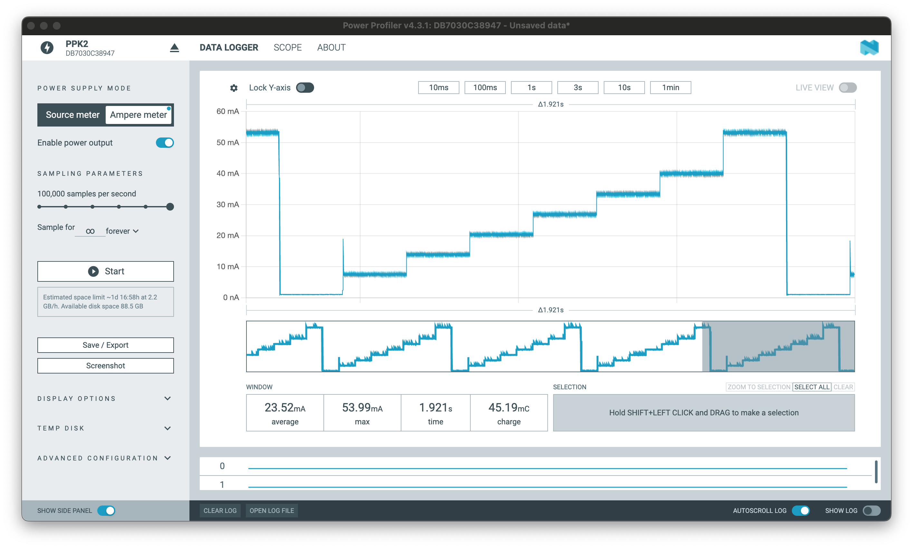
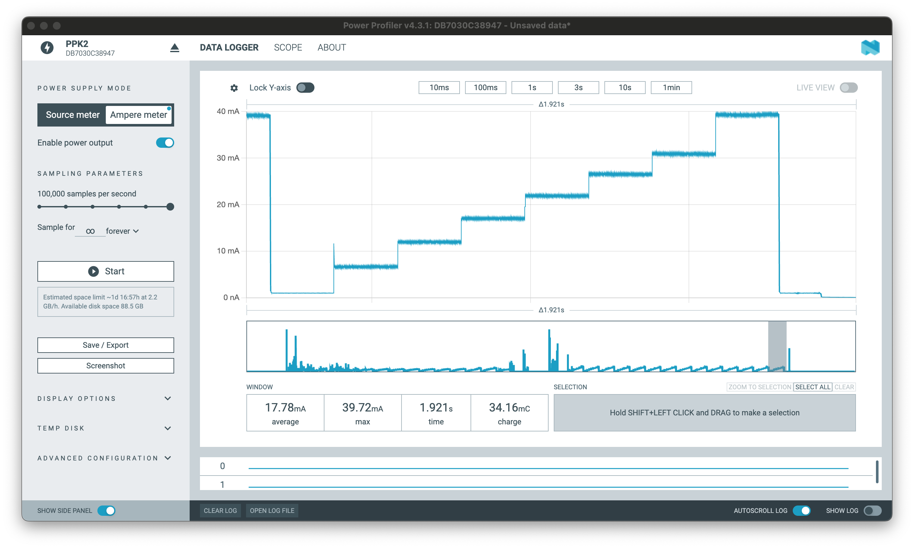
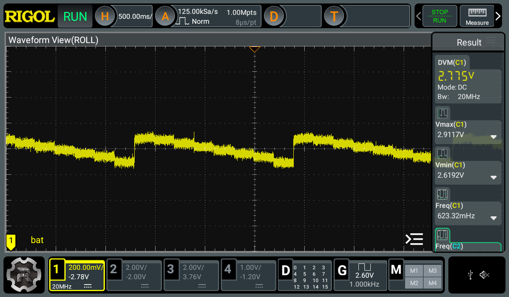
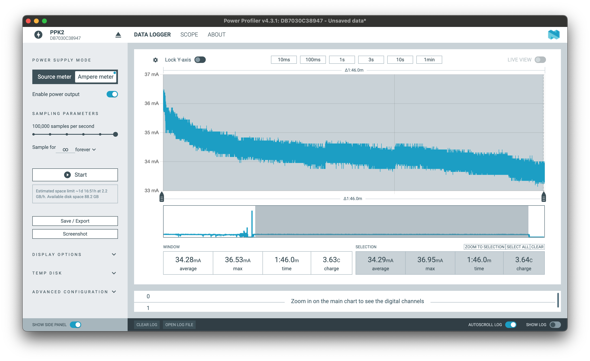
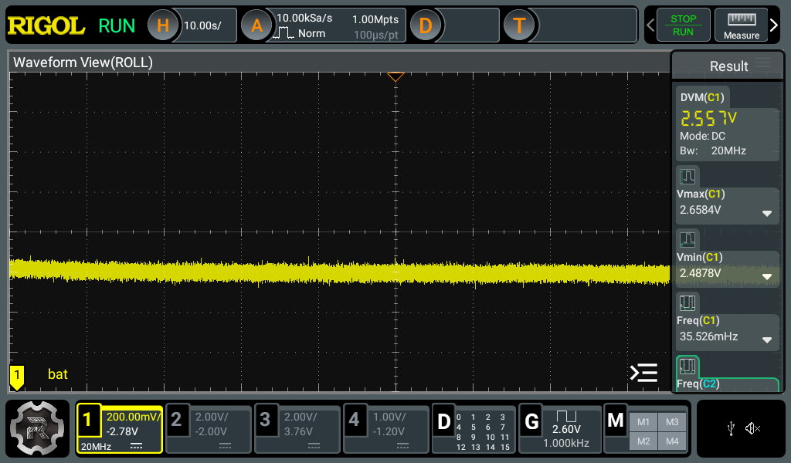
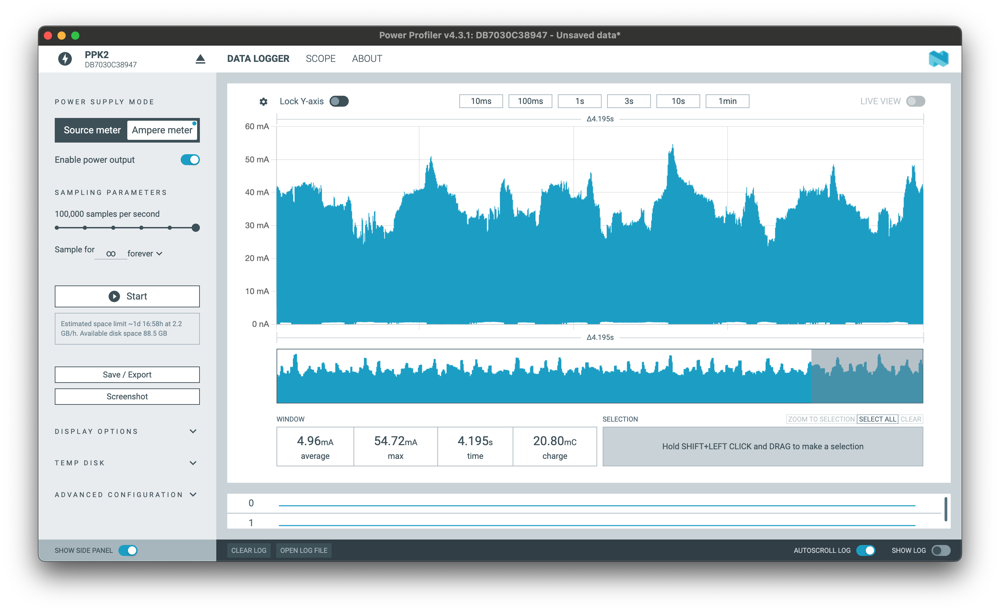
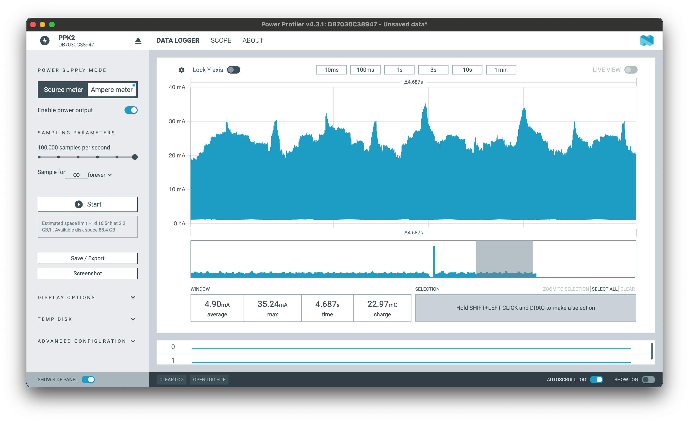
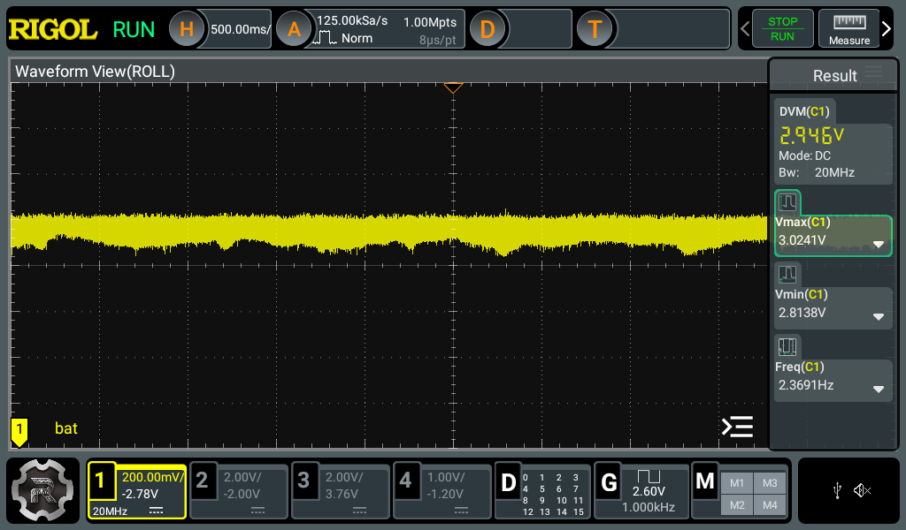
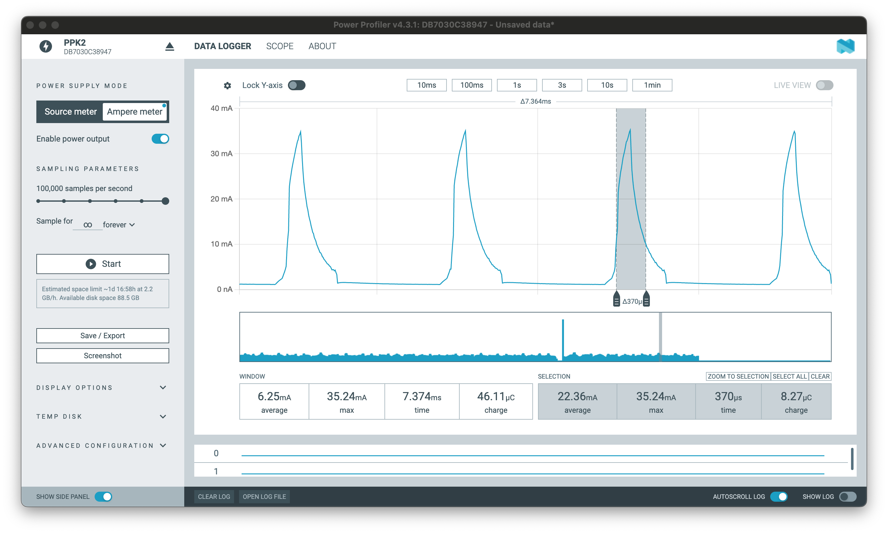
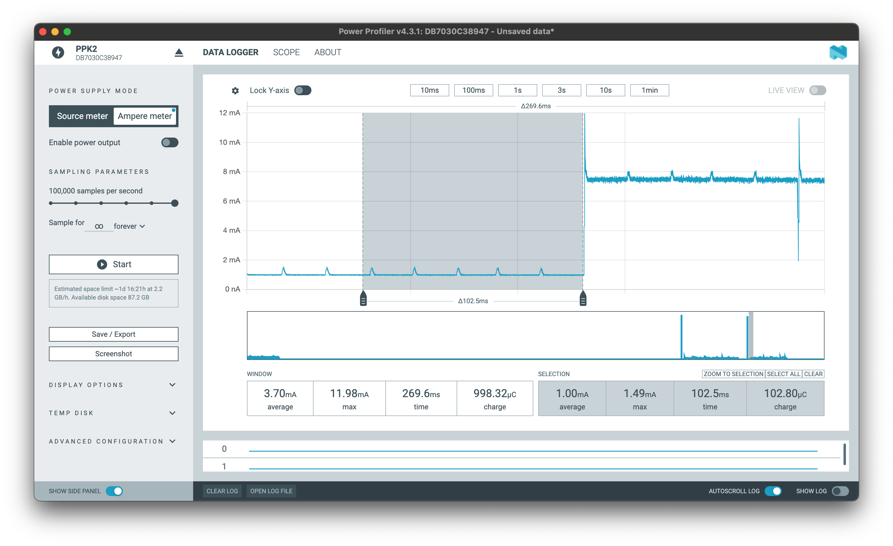

# Power Tests
Tests related to power consumption using a cheap CR2450 battery ([EEMB from Amazon](https://a.co/d/5ZDkXNy)). A few batteries were tested with varying capacities between 80-100%.

## Max Current Stress Test
This test measures the maximum current stress by running [TestLEDMaxCurrent.ino](firmware/TestLEDMaxCurrent/TestLEDMaxCurrent.ino) in step mode, which turns the LEDs on one at a time in 200 ms steps until they are all on.

Using a 3.0 V bench supply, the max current drawn is ~53 mA. This aligns with the expected consumption of:

$$
(8 \times LED) \times \frac{(3V_{\text{supply}} - 2.0V_{\text{LED forward}})}{150\Omega} + (1mA_{\text{ATTINY816 @ 1MHz}}) \approx 54mA
$$

Using the battery, it is able to source around ~38 mA at the same maximum step, resulting in a voltage drop of about 300 mV to ~2.7 V (~8 Ω ESR):

&nbsp;&nbsp;&nbsp;&nbsp;&nbsp;&nbsp;&nbsp;&nbsp;&nbsp;&nbsp;&nbsp;&nbsp;&nbsp;&nbsp;&nbsp;&nbsp;&nbsp;&nbsp;

The battery is also able to sustain >30 mA DC drain for several minutes with only slowly decreasing voltage plateauing around ~2.5V (~17 Ω ESR). This test was run from [TestLEDMaxCurrent.ino](firmware/TestLEDMaxCurrent/TestLEDMaxCurrent.ino) (not in step mode):

&nbsp;&nbsp;&nbsp;&nbsp;&nbsp;&nbsp;&nbsp;&nbsp;&nbsp;&nbsp;&nbsp;&nbsp;&nbsp;&nbsp;&nbsp;&nbsp;&nbsp;&nbsp;

After 2 hours, the voltage was at 2.37 V at 25 mA (~25 Ω ESR).

## PWM Pattern Operation
The Twinkle pattern in [TestPWMs.ino](firmware/TestPWMs/TestPWMs.ino) is a good indication of a typical LED pattern with reasonable brightness (shown in the [README](README.md) gif). This pattern randomly adjusts LED brightness via PWM without any attention to phase alignment. The individual duty cycles are low, but occasionally both PWM timers align and all 8 LEDs briefly draw max current for up to the max duty cycle (~16% @ ~500 Hz = ~310 µs). 

On the bench supply, you can see the occasional max draw of ~53 mA when this occurs, agreeing with the stress test above.

On the battery, the consumption also agrees with the stress test, maxing out at ~35 mA:

&nbsp;&nbsp;&nbsp;&nbsp;&nbsp;&nbsp;&nbsp;&nbsp;&nbsp;&nbsp;&nbsp;&nbsp;&nbsp;&nbsp;&nbsp;&nbsp;&nbsp;&nbsp;

Unlike the DC drain test, the battery voltage can now be easily maintained at its nominal 3V, as the average current is much lower and it only needs to recover from short pulses—the worst being when both PWM timers overlap like the one below:

There are [4.7 µF capacitors at each of the 8x LEDs](hardware/Bracelet/Sch_WeddingLEDBracelet_R3.pdf) that may help to minimize max voltage droop of short PWM pulses as the battery ESR increases with depletion. If ESR becomes an issue, faster PWM frequencies (> 500 Hz) could be tried to better utilize these capacitors during strenuous patterns. 

## Non-LED Power Consumption
The LEDs are the main consumers of current. However, the MCU, accelerometer, and touch sensor also consume current. This can be measured from [TestHardware.ino](firmware/TestHardware/TestHardware.ino) before the LED pattern begins. This current is <1 mA with periodic spikes to 1.5 mA from the PTC (MCU touch sensor controller).

## Current Draw Guidelines
- For a relatively fresh battery, it seems to be safe to draw the maximum current of the circuit, at least in bursts of up to ~310 µs (max PWM duty cycle in the [TestPWMs.ino](firmware/TestPWMs/TestPWMs.ino) pattern).
- Sustained max current draw is possible, with >30 mA delivery for at least a few minutes at a time. ESR increases, but voltage is maintained well above brownout voltage of 2.0V.
- There is probably no practical benefit from power-optimizing the accelerometer, PWM phase offset, or MCU power states (at least at 1 MHz MCU clock), when using features like the ones in these test programs.
