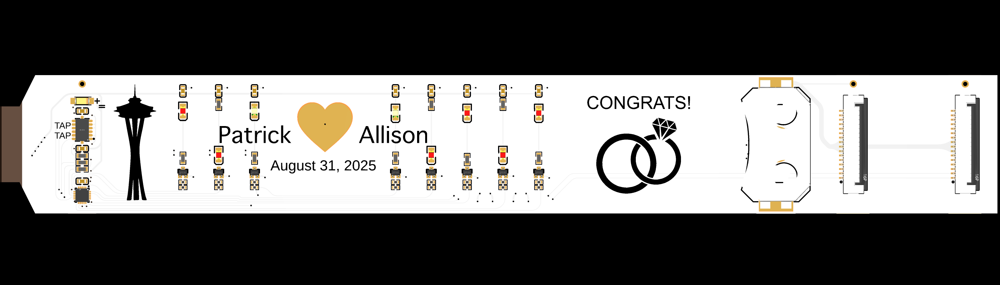
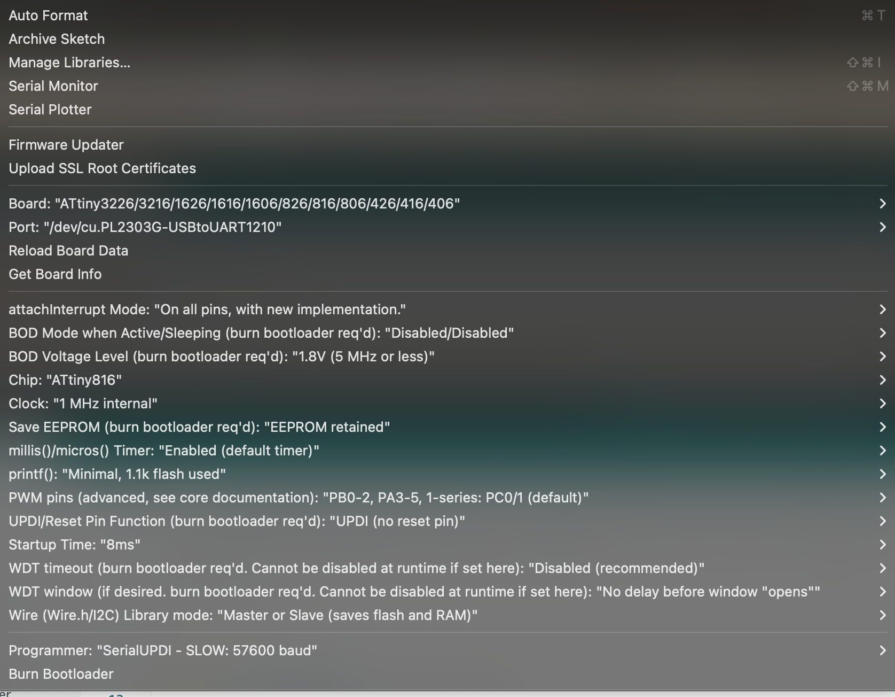

# WeddingLEDBracelet
Hardware information and firmware for a wedding-themed LED Bracelet.

The bracelet can be worn by snapping the edge connector into either the large size (outer) or small size (inner) ZIF connector. The ZIF connection is the power switch and the bracelet clasp, so it will activate when the connector is closed. The battery should be inserted with the **POSITIVE SIDE UP** as shown.

&nbsp;&nbsp;&nbsp;&nbsp;&nbsp;&nbsp;&nbsp;&nbsp;&nbsp;&nbsp;&nbsp;&nbsp;&nbsp;&nbsp;&nbsp;&nbsp;&nbsp;&nbsp;

## Contents

* **hardware:** Schematic and layout prints, and manufacturing files for the bracelet and programmer hardware
* **firmware:** Various Arduino firmware files for the bracelet

## Hardware

The hardware contains:

* ATTINY816 MCU
* 8x LEDS controlled with 7x PDM channels
* 1x Capacitive touch pad (heart)
* ADXL345 Accelerometer with motion and tap detection
* 3.0V CR2450 coin cell
* A breakout "programmer" PCB for accessing UART and UPDI pins

### MCU Pinout:

| Pin | Name | Peripheral       | Notes              |
|-----|------|------------------|--------------------|
| 1   | PA2  | -                | NC                 |
| 2   | PA3  | TCA0-W3          | LED3 (3rd red)     |
| 3   | GND  | -                | Power Supply       |
| 4   | VDD  | -                | Power Supply       |
| 5   | PA4  | TCA0-W4          | LED2 (2nd red)     |
| 6   | PA5  | TCA0-W5          | LED1 (1st red)     |
| 7   | PA6  | INT              | ADXL INT2          |
| 8   | PA7  | PTC-X3/Y3        | Heart Touch Pad    |
| 9   | PB5  | INT              | ADXL INT1          |
| 10  | PB4  | TCA0-W1 (ALT)    | LED4 (4th red)     |
| 11  | PB3  | TCA0-W0 (ALT)    | LED6 (6th red)     |
| 12  | PB2  | TCA0-W2          | LED5 (5th red)     |
| 13  | PB1  | I2C: SDA         | ADXL at 0x1D       |
| 14  | PB0  | I2C: SCL         | -                  |
| 15  | PC0  | TCB0-W0 (ALT)    | LED78(both yellow) |
| 16  | PC1  | -                | NC                 |
| 17  | PC2  | -                | NC                 |
| 18  | PC3  | -                | NC                 |
| 19  | PA0  | UPDI             | NC                 |
| 20  | PA1  | UART-TX (ALT)    | NC                 |

All LED and interrupt pins are active high.

## Programming
Programming is done via UPDI. During programming and debugging, the board can be powered by either the programmer or the battery. 

Do not connect the programmer power when the battery is being used! 

### Wire up the Programmer
Get a 3.3V USB-UART adapter (e.g., [DSD TECH SH-U09C5](https://a.co/d/dYEtSY1)) and connect to the programmer breakout in the following way:

* **UDPI:** Connect the RX port of a USB-to-UART adapter to the UPDI pin. Also connect the TX port of the adapter to the UDPI pin through a series 1KΩ resitor like the drawing [here](https://github.com/mraardvark/pyupdi/blob/master/README.md).
* **GND:** Connect to the USB-to-UART adapter's ground pin.
* **+3V:** Connect to 3.3V. Be careful using voltage rails from the USB-to-UART adapters, many are 5V and this board is not 5V tolerant. Do not connect this pin when using the battery!
* **RX:** Optionally, connect this to another USB-to-UART RX port for debugging

The clasp must be closed to power the board, so close the bracelet using the outer clasp, and connect the programmer to the inner clasp as shown below:

### Environment Setup
1. Download [Arduino](https://www.arduino.cc/en/software/) v2 IDE
1. In Settings, add the following to the Additional Boards Manager URLs: http://drazzy.com/package_drazzy.com_index.json
1. Install the "megaTinyCore" board package from the Boards Manager
1. Install the "SparkFun ADXL345 Arduino Library" from the Library Manager
1. Install the megaTinyCore PTC Library [here](https://github.com/SpenceKonde/megaTinyCore/tree/master/megaavr/libraries/PTC)
1. Set your Tools options like the following:  
1. megaTinyCore can save these settings to your board's hardware fuse settings with "Burn Bootloader"
1. You can now load the firmware from this repository and upload using Sketch > Upload Using Programmer
1. Optionally, connect to the board's UART TX for debugging using a separate serial port connection outside of Arduino (e.g., minicom). This pin is exposed on the programmer breakout labeled "RX". 

## Notes
- The absolute max voltage of the least tolerant part (accelerometer) is 3.9V. Don't exceed this.
- Power optimizations of the accelerometer, PWM phase offsets, and MCU power states are probably not worth the effort. At 1MHz MCU clock and default accelerometer settings, the MCU+accelerometer only consumes 1mA, then the LEDs consume ~7mA each.
- MCU brownout is at 1.8V, but Accelerometer brownout could be as high as 2.0V depending on the conditions. This appears to be generally safe with the CR2450, especially with reasonable PWM-based LED patterns and low MCU clock. Some power measurements verifying this are shown in [PowerTests.md](PowerTests.md).

## Useful Links
- [Power tests for this bracelet](PowerTests.md)
- [ATTINY816 Datasheet](https://ww1.microchip.com/downloads/aemDocuments/documents/MCU08/ProductDocuments/DataSheets/ATtiny417-814-816-817-DataSheet-DS40002288A.pdf)  
- [ADXL345 Datasheet](https://www.analog.com/media/en/technical-documentation/data-sheets/adxl345.pdf)  
- [Red LED Datasheet](https://www.lcsc.com/product-detail/C7371909.html)
- [Yellow LED Datasheet](https://www.lcsc.com/product-detail/C7371908.html)
- [Example UPDI Programmer Schematic](https://learn.adafruit.com/assets/127237)  
- [megaTinyCore Repository](https://github.com/SpenceKonde/megaTinyCore/tree/master)  

